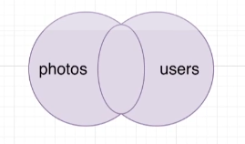

# Relating Records with Joins

## Joins

* Produces values by merging together rows from different related tables.
* Use a join most times that you're asked to find data that involves multiple resources.

## Aggregation

* Looks at many rows and calculates a single value.
* Words like 'most', 'average', 'least' are a sign that you need to use an aggregation.

## Notes on Joins

* Table order between FROM and JOIN frequently makes a difference.
* We must give context if column names collide.
* Tables can be renamed using the 'AS' keyword.
* There are a few kinds of joins.

## Four kinds of Joins

### Inner Join

### Left Outer Join

### Right Outer Join

### Full Join



```postgresql
SELECT url, username FROM photos FULL JOIN users on users.id = photos.user_id;
```
